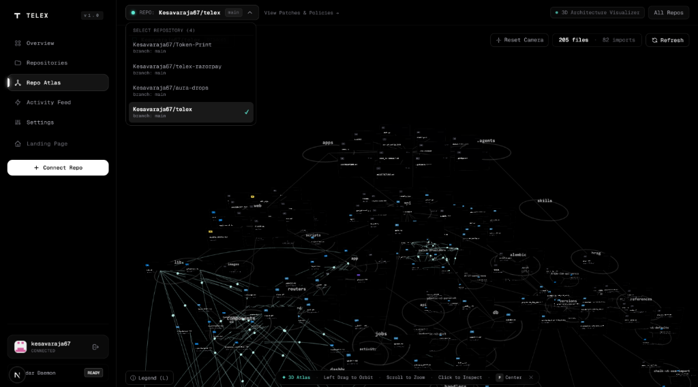
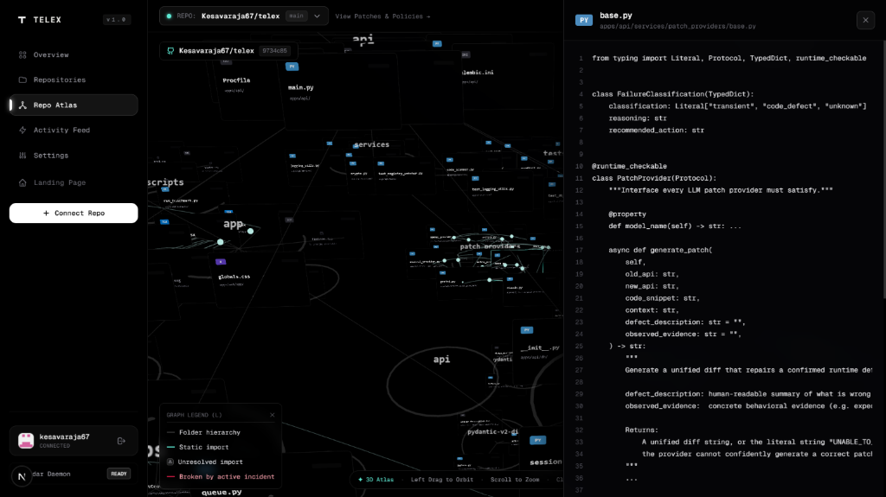

<div align="center">
  
  <h1>Telex</h1>
  <p><b>Autonomous dependency self-healing and 3D architectural cartography for production codebases.</b></p>
  <p>
    Watches npm &amp; PyPI · Maps 3D Repo Atlas · AST-scans affected repos ·<br>
    Calls LLMs for verified patches · Verifies in ephemeral CI sandboxes · Opens human-reviewed pull requests.
  </p>

  [](https://github.com/Kesavaraja67/telex/actions/workflows/ci.yml)
  [](LICENSE)
  [](apps/api)
  [](https://github.com/psf/black)
  [](https://github.com/astral-sh/ruff)
  [](ARCHITECTURE.md)

  <br><br>
  

</div>

---

## The problem

When `axios@1.8.0` drops a breaking API change at 3 AM, your CI breaks in the morning, an engineer spends 2 hours on git-blame archaeology, and the fix is usually a 4-line change.

**Telex handles the 4-line change.** Before your engineers get to work.

- **Telex watches the packages**: Continuously monitors npm & PyPI registries for new versions, changelogs, and breaking symbol releases.
- **Repo Atlas maps the codebase & blast radius**: Renders a dedicated 3D force-directed architecture visualizer showing every internal AST import, module layer, and real-time failure propagation cascade when a package breaks.
- **Telex calls the LLM for fixes**: Generates precision unified diffs targeting only the affected call sites.
- **Telex verifies before merging**: Runs your repo's actual test suites in ephemeral CI sandboxes and opens transparent, human-reviewed pull requests.

---

## How it works

```
                    npm / PyPI registry
                             │
                             ▼  poll_registry  (watches packages 24/7)
Detect new versions  ──→  extract_changes  (LLM parses breaking symbols from changelog)
                             │
     ┌───────────────────────┴───────────────────────┐
     ▼                                               ▼
3D Repo Atlas (/dashboard/atlas)            scan_repo  (Tree-Sitter AST)
Maps imports in 3D force layout             Find affected call sites
Pockets & illuminates live breakage pulse   TypeScript · TSX · JS · Python
Visualizes blast radius in real time                 │
                                                     ▼  generate_patch  (calls LLM for fix)
                                            Best-of-3 candidates → smallest valid diff
                                                     │
                                                     ▼  validate_patch  (ephemeral CI sandbox)
                                            Repo's own test suite + typecheck gate
                                                     │
                                                     ▼  open_pr  (GitHub Pull Request + Check Run)
                                            Verification receipt in body  ·  "Telex Validation" check
                                            Never auto-merges — a human reviews and merges
```

Every stage is a Postgres-backed async job with `SELECT … FOR UPDATE SKIP LOCKED`, exponential backoff, heartbeat leases, and per-installation fairness caps.

---

## What Repo Atlas does

Accessible directly from the dashboard sidebar at `/dashboard/atlas`, **Repo Atlas** is Telex's dedicated 3D architectural visualizer and blast radius intelligence engine:

<br>

<br><br>

1. **3D Codebase Cartography**: Ingests your repository snapshot and resolves static AST import graphs across **TypeScript, JavaScript, Python, Go, Rust, Java, C/C++, Ruby, and PHP**. Nodes settle into layered horizontal depth planes with collision-free polar force simulation.
2. **Visual Blast Radius Mapping**: When Telex detects that an upstream package has changed or broken an API, Repo Atlas shows you the exact downstream blast radius — which files import the caller, which internal modules depend on them, and where the failure will propagate.
3. **Live Breakage Overlay (SSE)**: Subscribes to real-time incident streams (`/api/repos/{id}/incidents/stream`) to pulse broken files and severed import wires in high-visibility crimson (`#E11D48`) while Telex's patch generator works.
4. **Interactive In-Canvas Code Inspection**: Click any 3D card to open a slide-in syntax-highlighted code viewer, inspect line-level call sites, check last-commit author/timestamp, and review connected callers before the LLM patch lands.
5. **Universal Multi-Repository Switching**: Seamlessly jump between any connected repositories with an instant dropdown switcher in the top bar.

<br>

<br>

---

## What's different

| | Naive approach | Telex |
|---|---|---|
| **Package Watchdog** | Wait for CI to break or Dependabot noise | Proactive 24/7 registry polling with LLM breaking symbol extraction |
| **Architecture & Atlas** | Flat file trees & blind grep | Dedicated 3D Tree-Sitter AST dependency visualizer + live incident breakage overlay |
| **Blast Radius** | Guesswork across logs and git blame | Instant 3D visual propagation mapping showing affected callers across the stack |
| **Usage search** | `grep -r 'symbol'` | Tree-Sitter AST — zero false positives from comments or strings |
| **Fix Generation (LLM)** | Single generic prompt | Best-of-3 candidates → structural filter → `git apply` verify → smallest valid diff |
| **Verification** | "runs locally" or trust LLM | Ephemeral sandbox running the **repo's own test suite** on the actual patch |
| **PR transparency** | Generic "AI fix" | Explicit `verification_mode` + gate evidence in every PR body |
| **Multi-tenancy** | Global FIFO | Per-installation cap — one high-volume org can't starve others |
| **LLM provider** | One hardcoded key | BYOK for 10 providers · Fernet-encrypted at rest · Gemini fallback |

---

## LLM Providers

Telex ships with 10 provider implementations. Bring your own key in Settings — or use the platform's hosted Gemini with zero configuration.

| Provider | Default model |
|---|---|
| Google Gemini *(platform default)* | `gemini-2.5-flash` |
| OpenAI | `gpt-4o-mini` |
| Anthropic Claude | `claude-sonnet-4-5` |
| Mistral AI | `mistral-small-latest` |
| Groq | `llama-3.3-70b-versatile` |
| Cohere | `command-r-plus-08-2024` |
| xAI Grok | `grok-3-mini` |
| DeepSeek | `deepseek-chat` |
| Together AI | `llama-3.3-70B-Instruct-Turbo` |
| Nvidia Nemotron | `llama-3.1-nemotron-70b-instruct` |

---

## Security

- **BYOK keys**: Fernet-encrypted at rest. Plaintext only in memory during the `POST /api/settings/api-keys` handler. Never stored, never logged, never returned after save.
- **Log redaction**: Global filter on the root logger strips `sk-*`, `AIza*`, `sk-ant-*`, and 40+ character tokens from every log line before emission.
- **Webhooks**: HMAC-SHA256 (`X-Hub-Signature-256`) verified before any payload processing.
- **Sessions**: Cross-origin `/api/auth/me` with HttpOnly JWT cookies — no `document.cookie` cross-domain hacks.
- **CI**: `pip-audit` (Python) + `npm audit` (Node) + Gitleaks secret scanning on every push and PR.
- **No automerge**: At any confidence level. Ever. Not configurable. By design.

---

## Stack

**Backend** — FastAPI · SQLAlchemy 2 async · PostgreSQL 15 · Alembic · APScheduler · PyGithub · Tree-Sitter 0.21 · cryptography (Fernet) · python-jose

**Frontend** — Next.js 16 (App Router) · TypeScript strict · Three.js · d3-force-3d · Vanilla CSS & Tailwind CSS

---

## Local setup

```bash
# Clone
git clone https://github.com/Kesavaraja67/telex.git
cd telex

# Backend
cp .env.example apps/api/.env
# → fill in GITHUB_APP_ID, GITHUB_APP_PRIVATE_KEY, GEMINI_API_KEY, DATABASE_URL

# Generate BYOK encryption key (required)
python -c "from cryptography.fernet import Fernet; print(Fernet.generate_key().decode())"
# → paste output as TELEX_ENCRYPTION_KEY in apps/api/.env

cd apps/api
python -m venv venv && source venv/bin/activate
pip install -r requirements.txt
alembic upgrade head
uvicorn main:app --reload --port 8000

# Frontend (separate terminal)
cd apps/web
npm install && npm run dev
# → http://localhost:3000/dashboard
```

---

## Tests

```bash
cd apps/api
pytest -v
```

The backend test suite covers:

- **AST code scanning**: Symbol call-site extraction across TypeScript, TSX, JavaScript, and Python.
- **Dependency change extraction**: LLM parsing of structured breaking changes and confidence scoring.
- **Patch generation**: Multi-candidate generation, micro-apply validation, and minimal diff selection.
- **Patch validation**: Ephemeral sandbox CI execution, test suite and typecheck gates.
- **GitHub integration**: App installation syncing, branches, check runs, and human-review PR workflows.
- **Job queue**: PostgreSQL `SKIP LOCKED` worker queues with per-installation fairness caps and heartbeats.
- **Repository management**: Policy toggles, telemetry polling, and synchronization.
- **Authentication & Webhooks**: GitHub App HMAC verification and JWT sessions.
- **Provider configuration**: Encrypted BYOK key management across 10 LLM providers.
- **Breaking-change fixtures**: Real-world benchmarks for breaking dependency updates.

> **Note on Test Coverage**: The `apps/api` test suite enforces a ≥80% branch and statement coverage gate in CI. Integration-heavy modules that interface directly with external platforms (such as live PyGithub API calls and remote runner operations) are decoupled with mock harnesses or verified via end-to-end sandbox workflows.

---

## Repository layout

```
apps/api/
  alembic/versions/     10 migrations (schema history preserved, including repo_atlas_graphs)
  db/models.py          User, Installation, Repo, Patch, ValidationRun, RepoAtlasGraph, …
  jobs/handlers/        poll_registry · extract_changes · scan_repo · generate_patch · validate_patch · build_atlas_graph · open_pr
  jobs/queue.py         SKIP LOCKED + per-installation fairness cap
  routers/              auth · repos · packages · webhooks · stats · settings · atlas
  services/
    code_scanner.py     Tree-Sitter AST (TS, TSX, JS, Python)
    import_graph.py     Multi-language AST import graph engine (TS, JS, Py, Go, Rust, Java, C/C++, Ruby, PHP)
    crypto.py           Fernet BYOK key encryption (single swappable _get_master_key)
    github_service.py   GitHub App: branches · PRs · Check Runs · rate-limit backoff
    patch_providers/    10 LLM implementations + BYOK-aware factory
  tests/                Unit and integration test suite with benchmark fixtures

apps/web/app/dashboard/
  page.tsx              Telemetry overview
  repos/                Repo list · policy toggles · per-repo change/patch/PR detail
  atlas/                Dedicated 3D Repo Atlas · AST dependency visualizer · real-time incident mapping
  settings/             BYOK key management (10 providers, live status)
  activity/             Cross-repo reverse-chronological event feed
```

---

<div align="center">
  <a href="ARCHITECTURE.md">Architecture</a> · 
  <a href="DEMO.md">Evaluator Guide</a> · 
  <a href="CONTRIBUTING.md">Contributing</a> · 
  <a href="CODE_OF_CONDUCT.md">Code of Conduct</a> · 
  <a href="LICENSE">MIT License</a>
</div>
