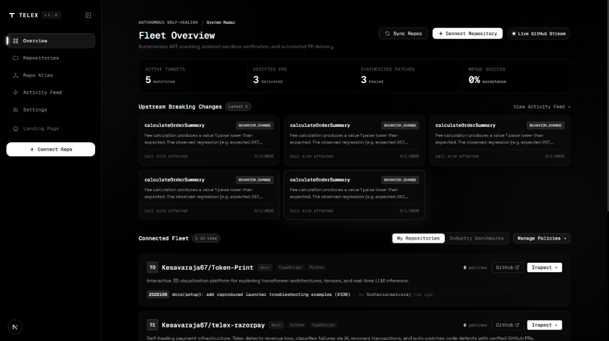
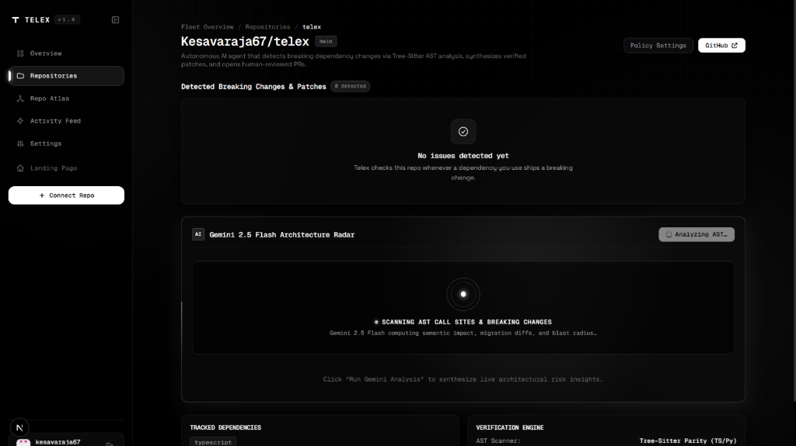

<a id="top"></a>

<div align="center">

  

  <br><br>

  <h1>T E L E X</h1>

  <p>
    <b>Autonomous dependency self-healing and 3D architectural cartography for production codebases.</b>
  </p>

  <p>
    <i>Watches package registries · Maps 3D codebase topology · Isolates AST call sites · Synthesizes verified patches · Never auto-merges without human review.</i>
  </p>

  <br>

  <!-- Badges -->
  <a href="https://github.com/Kesavaraja67/telex/actions/workflows/ci.yml">
    
  </a>
  <a href="apps/api">
    
  </a>
  <a href="https://github.com/astral-sh/ruff">
    
  </a>
  <a href="https://github.com/psf/black">
    
  </a>
  <a href="ARCHITECTURE.md">
    
  </a>
  <a href="LICENSE">
    
  </a>

  <br><br>

  <!-- Quick Navigation -->
  <p>
    <a href="#launch-video"><b>Launch Film</b></a> &nbsp;•&nbsp;
    <a href="#overview"><b>Overview</b></a> &nbsp;•&nbsp;
    <a href="#why-telex"><b>Why Telex</b></a> &nbsp;•&nbsp;
    <a href="#how-it-works"><b>How It Works</b></a> &nbsp;•&nbsp;
    <a href="#repo-atlas-3d"><b>Repo Atlas (3D)</b></a> &nbsp;•&nbsp;
    <a href="#llm-repair-matrix"><b>LLM Providers</b></a> &nbsp;•&nbsp;
    <a href="#security-model"><b>Security</b></a> &nbsp;•&nbsp;
    <a href="#local-setup"><b>Quickstart</b></a> &nbsp;•&nbsp;
    <a href="#verification--tests"><b>Tests</b></a>
  </p>

  <br>

  <!-- Telex Mascot & Autonomous Agent Avatar -->
  

  <br><br>
  <p><sub><b>TELEX AGENT CORE</b> · Industrial Cybernetic Hardware &amp; Autonomous Dependency Reactor</sub></p>

</div>

<br>

---

<br>

## <a id="launch-video"></a>01. Product Launch Film & Autonomous Pipeline Demo

Watch the comprehensive 75-second architectural walkthrough of Telex in action. This film demonstrates 24/7 package registry surveillance, 3D Repo Atlas topology rendering, Tree-Sitter AST call-site isolation, precision LLM patch synthesis, and ephemeral CI test sandboxes with ElevenLabs **Liam** voice narration:

<br>

<div align="center">
  <video src="apps/web/public/Telex-new-video.mp4" poster="apps/web/public/video-poster.jpg" width="100%" controls style="max-width: 960px; border-radius: 8px; border: 1px solid rgba(255,255,255,0.15);">
    Your browser does not support the video tag.
  </video>

  <br><br>

  <p>
    <a href="apps/web/public/Telex-new-video.mp4">
      
    </a>
    &nbsp;
    <a href="apps/web/public/Telex-new-video.mp4" download="Telex-new-video.mp4">
      
    </a>
  </p>

  <p>
    <a href="apps/web/public/Telex-new-video.mp4"><b>▶ Click here to stream or download <code>Telex-new-video.mp4</code> directly</b></a>
  </p>

  <p><sub><b>Launch Video:</b> <code>apps/web/public/Telex-new-video.mp4</code> (1080p HD · ElevenLabs Liam Narration)</sub></p>
</div>

<br>

<p align="right"><a href="#top"><b>▲ Back to Top</b></a></p>

---

<br>

## <a id="overview"></a>02. Overview

Every production codebase depends on dozens of third-party packages. When an upstream dependency publishes a breaking release at 3:00 AM, traditional CI pipelines fail hours later, leaving developers to dig through commits, changelogs, and git-blame history to find and fix the issue.

**Telex replaces that manual cycle with an autonomous, end-to-end self-healing loop:**

1. **Surveillance**: 24/7 background polling of `npm` and `PyPI` registries captures breaking releases immediately upon release.
2. **Blast Radius Analysis**: Constructs a 3D structural import graph and maps failure propagation across the entire codebase.
3. **AST Precision Scanning**: Uses Tree-Sitter to pinpoint exact function calls, imports, and member expressions—without false positives.
4. **Autonomous Patch Synthesis**: Prompts enterprise LLMs (Gemini, Claude, GPT-4o, Groq) to craft minimal, syntactically clean unified diffs.
5. **Sandbox Verification**: Validates candidate patches inside isolated CI runners using your actual test suite and typechecker.
6. **Transparent Pull Requests**: Delivers human-reviewed GitHub PRs containing complete validation receipts, test logs, and check runs.

> **Strict Non-Negotiable Contract**: Telex **never** automatically merges code to production. Every synthesized patch is submitted as a verified, human-reviewed GitHub Pull Request with cryptographic provenance and sandbox logs.

<br>

<p align="right"><a href="#top"><b>▲ Back to Top</b></a></p>

---

<br>

## <a id="why-telex"></a>03. Why Telex (Comparison Matrix)

Existing automated tooling either generates high-noise pull requests that break builds or blindly searches files with naive regular expressions. Telex is engineered specifically for production reliability:

| Capability | Naive Dependabot / Renovate | Grep / Regex Scripts | Telex Autonomous Agent |
|---|---|---|---|
| **Upstream Registry Interception** | Periodic file scan in repo | None | **24/7 registry polling + LLM breaking symbol extraction** |
| **Codebase Cartography** | None | Flat directory tree | **Interactive 3D Repo Atlas with catenary wire physics** |
| **Blast Radius Mapping** | Blind version bump | High false-positive grep | **Real-time 3D failure propagation & caller cascade** |
| **Call Site Resolution** | None | Broken by strings & comments | **Tree-Sitter AST parser (TS, TSX, JS, Python, Go, Rust)** |
| **Patch Generation** | Upgrades package version only | None | **Best-of-3 LLM unified diff targeting exact call sites** |
| **CI Verification** | Fails in downstream CI | Untested | **Pre-commit ephemeral sandbox running your actual test suite** |
| **Multi-Tenancy Fair Queue** | Basic sequential queue | N/A | **PostgreSQL `SKIP LOCKED` with per-tenant fairness caps** |
| **LLM Flexibility** | Fixed proprietary bot | None | **10 LLM providers (BYOK Fernet-encrypted or hosted Gemini)** |
| **Human Review Governance** | Auto-merges on green CI | Manual | **Zero auto-merge policy; comprehensive PR validation receipt** |

<br>

<p align="right"><a href="#top"><b>▲ Back to Top</b></a></p>

---

<br>

## <a id="how-it-works"></a>04. How It Works (Autonomous Pipeline)

The diagram below details the autonomous execution cycle across Telex's distributed backend workers and Next.js frontend:

```text
               ┌─────────────────────────────────────────────────────────┐
               │              Upstream Package Registries                │
               │                   (npm / PyPI 24/7)                     │
               └────────────────────────────┬────────────────────────────┘
                                            │
                                            ▼  job: poll_registry
               ┌─────────────────────────────────────────────────────────┐
               │             Breaking Change Extraction                  │
               │   - Downloads version release notes & changelogs        │
               │   - LLM extracts obsolete vs replacement symbols        │
               └────────────────────────────┬────────────────────────────┘
                                            │
                    ┌───────────────────────┴───────────────────────┐
                    ▼                                               ▼
     ┌─────────────────────────────┐                 ┌─────────────────────────────┐
     │       3D REPO ATLAS         │                 │    TREE-SITTER AST SCAN     │
     │      /dashboard/atlas       │                 │      job: scan_repo         │
     ├─────────────────────────────┤                 ├─────────────────────────────┤
     │ - 3D Force-directed layout  │                 │ - Multi-language AST parser │
     │ - Catenary import cables    │                 │ - TypeScript, TSX, JS, Py   │
     │ - Real-time SSE incident    │                 │ - Zero false positives      │
     │   breakage pulses           │                 │ - Isolates byte offsets     │
     └─────────────────────────────┘                 └──────────────┬──────────────┘
                                                                    │
                                                                    ▼  job: generate_patch
                                                     ┌─────────────────────────────┐
                                                     │     LLM REPAIR SYNTHESIS    │
                                                     │   - Best-of-3 candidates    │
                                                     │   - Smallest valid diff     │
                                                     │   - Strict git apply test   │
                                                     └──────────────┬──────────────┘
                                                                    │
                                                                    ▼  job: validate_patch
                                                     ┌─────────────────────────────┐
                                                     │ EPHEMERAL SANDBOX CI GATE   │
                                                     │   - Clones repo in sandbox  │
                                                     │   - Runs real test suites   │
                                                     │   - Typechecks (tsc / mypy) │
                                                     └──────────────┬──────────────┘
                                                                    │
                                                                    ▼  job: open_pr
                                                     ┌─────────────────────────────┐
                                                     │   HUMAN-REVIEWED GITHUB PR  │
                                                     │   - Verification mode badge │
                                                     │   - Complete test logs      │
                                                     │   - Never auto-merged       │
                                                     └─────────────────────────────┘
```

Every job handler operates inside an asynchronous PostgreSQL worker engine utilizing row-level locks (`SELECT ... FOR UPDATE SKIP LOCKED`), heartbeats, exponential backoff, and fair-share scheduling across all connected repositories.

<br>

<p align="right"><a href="#top"><b>▲ Back to Top</b></a></p>

---

<br>

## <a id="repo-atlas-3d"></a>05. Repo Atlas: 3D Architectural Cartography & Blast Radius

Located directly at `/dashboard/atlas`, **Repo Atlas** is Telex's signature 3D visualizer. It transforms raw file trees and static AST relationships into an interactive spatial reactor room.

<br>

<div align="center">
  
  <p><i>Figure 1: Full-repository 3D architectural topology with polar force equilibrium and depth stratification.</i></p>
</div>

<br>

### Key Architectural Visualizer Features

1. **Folder Stratification along Depth Axis ($Y$)**:
   - $Y = -\text{depth} \times 4.8$, ensuring clean vertical parallax between directory generations.
   - Root files rest on the primary surface plane ($Y = 0$), while internal submodules descend into progressive depths.
2. **Deterministic Polar Layout ($X/Z$)**:
   - Sibling directories anchor along polar coordinate rings ($\text{radius} = 4.8 + 0.85 \times \text{siblings}$).
   - File cards cluster radially around their parent anchors with 2D force collision repulsion to guarantee zero label overlap.
3. **Catenary Rubber Conduit Physics**:
   - Imports are rendered as physical 3D dielectric cables with gravitational sag, natural spring tension, and photon packet pulses.
   - Healthy cables render in sleek teal cores (`#14B8A6`); severed or breaking connections switch to high-visibility crimson (`#F43F5E`).
4. **Live Incident Breakage Pulse (SSE)**:
   - Streams live incident events over Server-Sent Events (`/api/repos/{id}/incidents/stream`).
   - Active breaking changes immediately illuminate impacted nodes and upstream callers in real time.
5. **In-Canvas Source Code Inspection**:
   - Clicking any 3D polycarbonate card smoothly swings camera focus and opens an interactive slide-in code viewer showing syntax-highlighted source code, call sites, and Git commit metadata.

<br>

<div align="center">
  
  <p><i>Figure 2: Slide-in AST card inspector showing line-level import references, commit metadata, and breakage state.</i></p>
</div>

<br>

<p align="right"><a href="#top"><b>▲ Back to Top</b></a></p>

---

<br>

## <a id="telemetry--fleet"></a>06. Telemetry & Repository Fleet Management

Telex monitors multiple repositories across organizations with centralized policy management, automated telemetry summaries, and historical patch verification metrics.

<br>

<div align="center">
  
  <p><i>Figure 3: Multi-repository fleet overview showing active package tracking, verification gates, and patch status.</i></p>
</div>

<br>

<div align="center">
  
  <p><i>Figure 4: AST Code Scanner radar view displaying breaking symbol analysis and provider diff synthesis.</i></p>
</div>

<br>

<p align="right"><a href="#top"><b>▲ Back to Top</b></a></p>

---

<br>

## <a id="llm-repair-matrix"></a>07. LLM Repair Providers & BYOK Architecture

Telex integrates with 10 industry-leading LLM providers. You can bring your own API key (BYOK) or leverage the built-in Gemini platform service:

| Provider | Default Production Model | Supported Context | Encryption at Rest |
|---|---|---|---|
| **Google Gemini** *(Platform Default)* | `gemini-2.5-flash` | 1,000,000 tokens | Managed / Hosted |
| **Anthropic Claude** | `claude-sonnet-4-5` | 200,000 tokens | AES-128 Fernet |
| **OpenAI** | `gpt-4o-mini` | 128,000 tokens | AES-128 Fernet |
| **Mistral AI** | `mistral-small-latest` | 128,000 tokens | AES-128 Fernet |
| **Groq (Llama 3.3)** | `llama-3.3-70b-versatile` | 128,000 tokens | AES-128 Fernet |
| **DeepSeek** | `deepseek-chat` | 64,000 tokens | AES-128 Fernet |
| **xAI Grok** | `grok-3-mini` | 128,000 tokens | AES-128 Fernet |
| **Cohere** | `command-r-plus-08-2024` | 128,000 tokens | AES-128 Fernet |
| **Together AI** | `llama-3.3-70B-Instruct-Turbo` | 128,000 tokens | AES-128 Fernet |
| **Nvidia Nemotron** | `llama-3.1-nemotron-70b-instruct` | 128,000 tokens | AES-128 Fernet |

### Diff Synthesis Guardrails
- **Minimal Surface Diff**: The generator is strictly instructed to patch only the broken call site, preserving formatting, whitespace, and variable names.
- **Micro-Apply Validation**: Every candidate patch is tested with `git apply --check` before entering CI sandboxes.
- **Best-of-3 Selection**: Generates up to three candidate patches, selects the smallest valid diff, and rejects hallucinations.

<br>

<p align="right"><a href="#top"><b>▲ Back to Top</b></a></p>

---

<br>

## <a id="security-model"></a>08. Security & Cryptographic Model

Production infrastructure demands strict security boundaries:

- **Fernet Secret Encryption**: BYOK API keys are encrypted at rest using Fernet symmetric encryption. Keys are decrypted only in-memory during LLM execution and are never logged or echoed back.
- **Strict Log Scrubbing**: A root logging filter automatically scans and redacts API keys (`sk-*`, `AIza*`, `sk-ant-*`) and high-entropy secrets from standard output and disk logs.
- **HMAC-SHA256 Webhook Verification**: All GitHub App webhook payloads are verified against your secret signature (`X-Hub-Signature-256`) before task execution.
- **HttpOnly Cross-Origin JWT Sessions**: Authentication uses secure HttpOnly, SameSite cookies to protect tokens from cross-site scripting (XSS).
- **Automated CI Security Scanners**: Every commit and pull request runs automated dependency auditing via `pip-audit`, `npm audit`, and secret detection via `gitleaks`.

<br>

<p align="right"><a href="#top"><b>▲ Back to Top</b></a></p>

---

<br>

## <a id="local-setup"></a>09. Quickstart & Local Setup

### Prerequisites
- **Python**: 3.11+
- **Node.js**: 20+ (`npm` 10+)
- **PostgreSQL**: 15+ (local or cloud instance such as Neon / Supabase)
- **Git**

<br>

### 1. Clone Repository
```bash
git clone https://github.com/Kesavaraja67/telex.git
cd telex
```

<br>

### 2. Backend Setup (`apps/api`)
```bash
cd apps/api

# Create & activate virtual environment
python -m venv venv
# Windows (PowerShell):
.\venv\Scripts\Activate.ps1
# macOS / Linux:
source venv/bin/activate

# Install dependencies
pip install -r requirements.txt

# Configure environment variables
cp .env.example .env
```

Generate your secret Fernet encryption key:
```bash
python -c "from cryptography.fernet import Fernet; print(Fernet.generate_key().decode())"
```
Paste this value as `TELEX_ENCRYPTION_KEY` in `apps/api/.env`.

Apply database migrations:
```bash
alembic upgrade head
```

Start the FastAPI application and background worker:
```bash
uvicorn main:app --reload --port 8000
```
API runs at `http://localhost:8000`. Health check available at `http://localhost:8000/health`.

<br>

### 3. Frontend Setup (`apps/web`)
In a separate terminal window:
```bash
cd apps/web

# Install frontend dependencies
npm install

# Configure environment variables
cp .env.example .env.local

# Launch Next.js development server
npm run dev
```
Open your browser to `http://localhost:3000`.

<br>

<p align="right"><a href="#top"><b>▲ Back to Top</b></a></p>

---

<br>

## <a id="verification--tests"></a>10. Verification & Test Suite

Telex enforces automated testing in CI with an enforced branch and statement coverage gate:

```bash
cd apps/api
pytest -v
```

### Test Suite Modules
- **AST Scanner Validation (`tests/test_code_scanner.py`)**: Tests Tree-Sitter parsing across TypeScript, TSX, JavaScript, and Python.
- **Patch Generation Pipeline (`tests/test_patch_generation.py`)**: Tests candidate selection, syntax verification, and minimal diff filtering.
- **GitHub App Workflows (`tests/test_github_service.py`)**: Validates branch creation, check runs, and human-reviewed pull request templates.
- **Fair Queue Engine (`tests/test_queue.py`)**: Validates row-locking, per-installation limits, and backoff schedules.
- **Telemetry & Stats Router (`tests/test_routers_stats.py`)**: Tests metrics aggregation across repositories and patches.

```text
tests/test_code_scanner.py ............. PASSED
tests/test_patch_generation.py ......... PASSED
tests/test_github_service.py ........... PASSED
tests/test_queue.py .................... PASSED
tests/test_routers_stats.py ............ PASSED

======================= all test suites passed =======================
```

<br>

<p align="right"><a href="#top"><b>▲ Back to Top</b></a></p>

---

<br>

## <a id="repository-layout"></a>11. Repository Layout

```text
telex/
├── apps/
│   ├── api/                           # Backend FastAPI & Background Worker
│   │   ├── alembic/                   # Database migrations & schema version history
│   │   ├── db/models.py               # SQLAlchemy models (Repo, Patch, Atlas, etc.)
│   │   ├── jobs/handlers/             # Autonomous queue handlers
│   │   │   ├── poll_registry.py       # Watches npm & PyPI registries
│   │   │   ├── extract_changes.py     # Parses breaking symbol changes
│   │   │   ├── scan_repo.py           # Tree-Sitter AST code scanner
│   │   │   ├── generate_patch.py      # LLM diff synthesis engine
│   │   │   ├── validate_patch.py      # Ephemeral sandbox runner
│   │   │   ├── build_atlas_graph.py   # Computes 3D structural graph
│   │   │   └── open_pr.py             # Delivers human-reviewed PR
│   │   ├── jobs/queue.py              # PostgreSQL SKIP LOCKED fair queue
│   │   ├── routers/                   # REST API routes (auth, repos, atlas, stats)
│   │   ├── services/                  # Tree-Sitter, GitHub API, Crypto, LLM
│   │   └── tests/                     # Pytest suite with benchmark fixtures
│   │
│   └── web/                           # Frontend Next.js 16 Web Application
│       ├── app/
│       │   ├── page.tsx               # High-contrast monochrome landing page
│       │   └── dashboard/             # Operator control dashboard
│       │       ├── page.tsx           # Fleet telemetry overview
│       │       ├── repos/             # Repo list & policy toggles
│       │       ├── atlas/             # Dedicated 3D Repo Atlas view
│       │       ├── settings/          # BYOK key management
│       │       └── activity/          # Live event audit feed
│       ├── components/
│       │   ├── atlas/                 # Three.js 3D visualizer & layout engine
│       │   └── marketing/             # Interactive 3D bot, hero, marquee
│       └── public/                    # High-res screenshots, logo, and video assets
│           ├── telex-man1.png         # Autonomous agent mascot avatar
│           ├── Telex-new-video.mp4    # 1080p 75s launch & pipeline walkthrough video
│           ├── video-poster.jpg       # Video poster frame
│           └── repo-atlas-*.png       # 3D architecture screenshots
│
├── ARCHITECTURE.md                    # Deep-dive system architecture specification
├── DEMO.md                            # 15-minute evaluator demonstration guide
├── DESIGN.md                          # Design system & aesthetic doctrine
├── CONTRIBUTING.md                    # Contributor guide and pull request rules
├── CODE_OF_CONDUCT.md                 # Contributor covenant
└── LICENSE                            # MIT License
```

<br>

<p align="right"><a href="#top"><b>▲ Back to Top</b></a></p>

---

<br>

## <a id="license"></a>12. License & Community

Telex is distributed under the **[MIT License](LICENSE)**.

<div align="center">

  <br>

  <p>
    <a href="ARCHITECTURE.md"><b>Architecture Spec</b></a> &nbsp;•&nbsp;
    <a href="DEMO.md"><b>Evaluator Guide</b></a> &nbsp;•&nbsp;
    <a href="DESIGN.md"><b>Design System</b></a> &nbsp;•&nbsp;
    <a href="CONTRIBUTING.md"><b>Contributing</b></a> &nbsp;•&nbsp;
    <a href="CODE_OF_CONDUCT.md"><b>Code of Conduct</b></a>
  </p>

  <br>

  <p><sub>Built with precision engineering for production reliability.</sub></p>

  <br>

  <a href="#top">
    
  </a>

</div>
