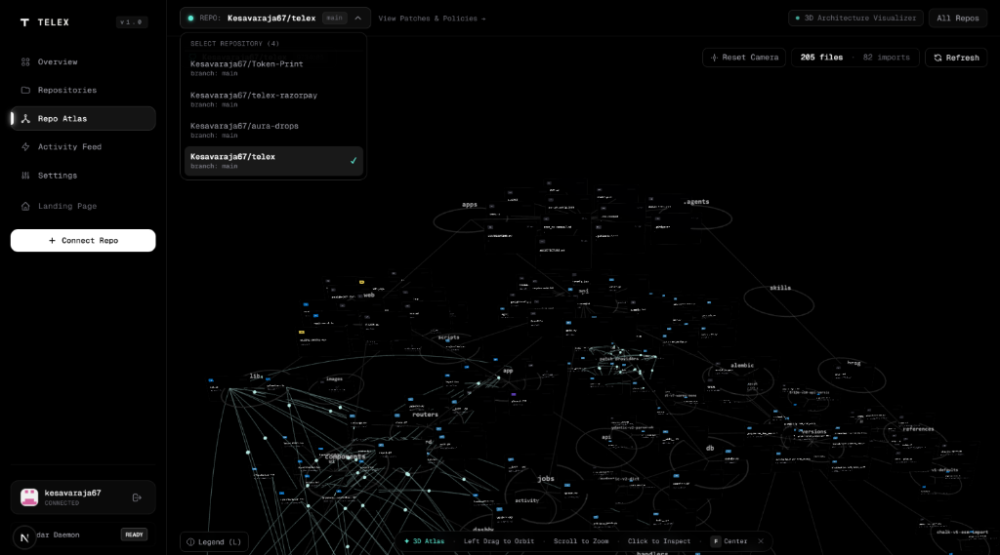
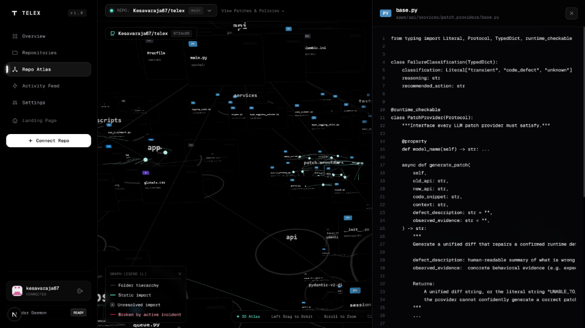
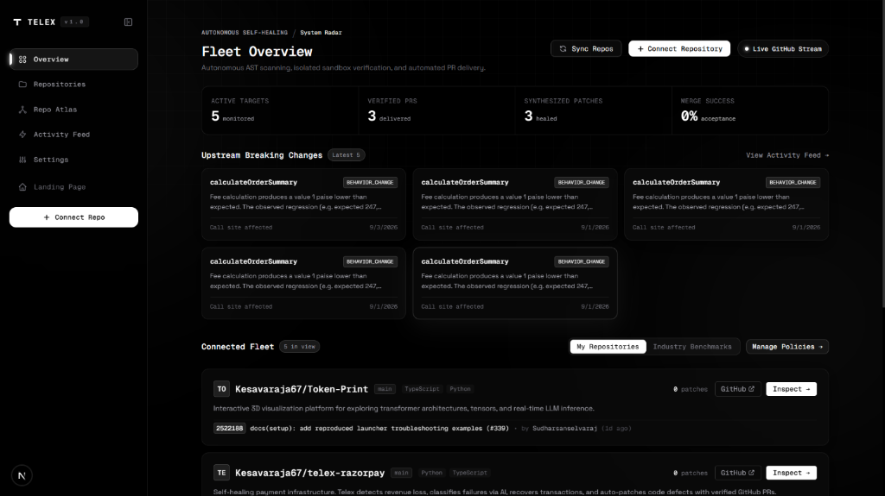
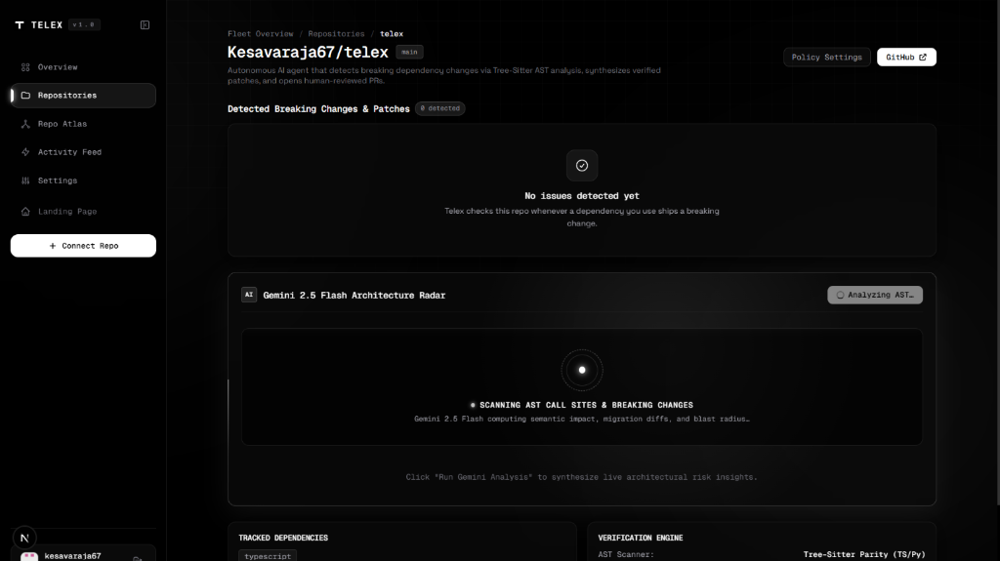

<a id="top"></a>

<div align="center">

  

  <br><br>

  <h1>T E L E X</h1>

  <p>
    <b>Automated dependency self-healing and 3D architectural cartography for production codebases.</b>
  </p>

  <p>
    <i>Watches package registries · Maps 3D codebase topology · Isolates AST call sites · Synthesizes verified patches · Never auto-merges without human review.</i>
  </p>

  <br>

  <!-- Badges -->
  <a href="https://github.com/Kesavaraja67/telex/actions/workflows/ci.yml">
    
  </a>
  <a href="apps/api">
    
  </a>
  <a href="https://github.com/astral-sh/ruff">
    
  </a>
  <a href="https://github.com/psf/black">
    
  </a>
  <a href="ARCHITECTURE.md">
    
  </a>
  <a href="LICENSE">
    
  </a>

  <br><br>

  <!-- Quick Navigation: 7 Fundamental Questions -->
  <p>
    <a href="#problem"><b>1. Problem</b></a> &nbsp;•&nbsp;
    <a href="#what-telex-does"><b>2. What Telex Does</b></a> &nbsp;•&nbsp;
    <a href="#who-is-it-for"><b>3. Target Audience</b></a> &nbsp;•&nbsp;
    <a href="#concrete-example"><b>4. Real Example</b></a> &nbsp;•&nbsp;
    <a href="#how-verification-works"><b>5. Verification</b></a> &nbsp;•&nbsp;
    <a href="#how-to-try-it"><b>6. Quickstart</b></a> &nbsp;•&nbsp;
    <a href="#architecture--deep-details"><b>7. Architecture</b></a>
  </p>

  <br>

  <!-- Telex Mascot Avatar -->
  

  <br><br>
  <p><sub><b>TELEX AGENT CORE</b> · Industrial Code Repair Engine &amp; Dependency Reactor</sub></p>

</div>

<br>

---

<br>

## Product Launch Film & Architectural Walkthrough

Watch the 75-second architectural walkthrough of Telex in action. This film demonstrates 24/7 package registry surveillance, 3D Repo Atlas topology rendering, Tree-Sitter AST call-site isolation, LLM patch synthesis, and ephemeral CI test sandboxes with ElevenLabs **Liam** voice narration:

<br>

<div align="center">

https://github.com/user-attachments/assets/f4042653-0351-4777-9391-a88c4b3345e8

  <br>
  <p><sub><b>Launch Video:</b> <code>Telex-new-video.mp4</code> (1080p HD · 75.0s · ElevenLabs Liam Narration)</sub></p>
</div>

<br>

<p align="right"><a href="#top"><b>▲ Back to Top</b></a></p>

---

<br>

## <a id="problem"></a>01. What Problem Does Telex Solve?

Every production application relies on dozens or hundreds of open-source packages. When an upstream dependency publishes a major or breaking release, existing dependency bots (Dependabot, Renovate) only bump the version string in `package.json` or `pyproject.toml` and open a pull request.

**The outcome is always one of two failure modes:**
1. **The PR immediately breaks CI:** The test suite or typechecker fails because function signatures changed or methods were removed. A software engineer must stop feature work, read third-party changelogs, search the repository for all affected call sites, rewrite the code, and re-test.
2. **The PR quietly passes CI but ships latent defects:** If test coverage doesn't assert the changed behavior, breaking semantic changes slip straight into production builds unnoticed.

Teams either freeze versions indefinitely—accumulating technical debt and security vulnerabilities—or spend hundreds of engineering hours manually performing mechanical dependency migrations.

<br>

<p align="right"><a href="#top"><b>▲ Back to Top</b></a></p>

---

<br>

## <a id="what-telex-does"></a>02. What Does Telex Actually Do?

Telex turns breaking dependency updates into verified, ready-to-merge GitHub pull requests that rewrite your call sites automatically.

```text
[Upstream Registry] ──(24/7 Poll)──> [Changelog Parser]
                                             │
                                   (Breaking Symbol List)
                                             │
                                             ▼
[Your Repository] ──(Tree-Sitter AST)──> [Exact Call Sites]
                                             │
                                    (Call-Site Context)
                                             │
                                             ▼
                                     [LLM Patch Engine]
                                             │
                                       (Unified Diff)
                                             │
                                             ▼
                                   [Sandbox CI Verification]
                                             │
                                    (Passing Test Proof)
                                             │
                                             ▼
                                 [Human-Reviewed GitHub PR]
```

### The 6-Stage Automated Lifecycle:
1. **Registry Surveillance**: Continuously polls `npm` and `PyPI` registries to detect published versions and fetch release metadata.
2. **Breaking Change Extraction**: Analyzes release notes and changelogs to identify removed, renamed, signature-changed, or behavior-changed API symbols with confidence ratings.
3. **AST Precision Scanning**: Uses Tree-Sitter to parse your repository's ASTs and locate exact call sites, imported identifiers, and member expressions—without regex false positives.
4. **Targeted Patch Synthesis**: Prompts enterprise LLMs (Gemini, Claude, GPT-4o, Groq) with the exact call site and migration contract to synthesize minimal, surgical unified diffs.
5. **Ephemeral Sandbox Verification**: Validates candidate patches in isolated GitHub Actions environments against your repository's actual test suites and typecheckers.
6. **Human-Reviewed Pull Requests**: Opens a single comprehensive PR per dependency upgrade containing full verification receipts, test logs, and risk classifications.

> **Strict Non-Negotiable Contract**: Telex **never** automatically merges code. Every patch requires human engineering review and approval before entering production.

### Risk Classification & Human-Review Model

1. **Mechanical vs. Semantic Risk Classification**:
   - Upstream breaking changes are analyzed by Gemini 2.0 Flash to extract structured change types (`removed`, `renamed`, `signature_change`, `deprecated`, `behavior_change`) along with extraction confidence.
   - A change is classified as a semantic risk if it is a `behavior_change` (always flagged—passing tests do not guarantee old behavior is preserved), or if it is a `signature_change` or `deprecated` with classifier confidence `< 75%`. Changes of type `removed` or `renamed` are treated as mechanical.
   - When a semantic risk is identified, Telex tags the PR title with `[semantic-risk]` and flags in the PR body: `⚠️ Possible semantic/behavior change — passing tests do not guarantee old behavior is preserved`.
2. **Fail-Closed Human Review Gate**:
   - Whenever a patch has weak evidence—such as missing test coverage on the affected symbol, failing CI checks, or unverified semantic risks—Telex attaches the GitHub label `needs-human-review` and highlights the review requirement in the PR description.
3. **Supply-Chain Defense (Install Scripts Blocked by Default)**:
   - Untrusted dependency upgrades can execute malicious arbitrary lifecycle hooks (`postinstall`, `preinstall`). During isolated CI sandbox verification, Telex defaults to `npm ci --ignore-scripts`, `pnpm install --frozen-lockfile --ignore-scripts`, and disables Python install scripts unless repository maintainers explicitly toggle `allow_install_scripts: true`.

<br>

<p align="right"><a href="#top"><b>▲ Back to Top</b></a></p>

---

<br>

## <a id="who-is-it-for"></a>03. Who Is Telex For?

Telex is built for:
- **Fast-Moving Product Teams**: Avoid losing days of sprint velocity every time a critical framework or library (e.g., Pydantic v1→v2, Axios v0→v1, Next.js, FastAPI) introduces breaking changes.
- **Platform & Infrastructure Teams**: Keep fleet-wide dependencies modern across dozens of microservices without manual patch coordination.
- **Maintainers of Mission-Critical Services**: Protect systems with strict, evidence-bound verification where passing tests on the exact commit SHA are required before any code is approved.

**Supported Ecosystems & Languages:**
- **Automated Dependency Repair (4 Languages)**:
  - **Node / TypeScript**: `.ts`, `.mts`, `.cts` (`package.json`)
  - **TSX**: `.tsx`
  - **JavaScript**: `.js`, `.mjs`, `.cjs`
  - **Python**: `.py` (`pyproject.toml`, `requirements.txt`, `setup.py`)
- **Polyglot AST Call-Site Scanning & Cartography (11 Dialects)**:
  - **Go**: `.go` (`go.mod`, `go.sum`)
  - **Rust**: `.rs` (`Cargo.toml`, `Cargo.lock`)
  - **Java**: `.java` (`pom.xml`, `build.gradle`)
  - **Ruby**: `.rb` (`Gemfile`)
  - **C# / .NET**: `.cs` (`.csproj`, `.sln`)
- **Package Registry Surveillance**:
  - Live Continuous Polling: **npm**, **PyPI**
  - Registry Hooks & Offline Manifests: **crates.io**, **Go Proxy**, **Maven**, **RubyGems**, **NuGet**
- **Repo Atlas 3D Visualization & Cartography**:
  - Full import-graph cartography supports **21 languages** including Go, Rust, Java, C/C++, Ruby, PHP, and more.

<br>

<p align="right"><a href="#top"><b>▲ Back to Top</b></a></p>

---

<br>

## <a id="concrete-example"></a>04. Concrete Before/After Example

### Scenario: Upgrading `axios` (v0.x → v1.x)
In Axios v1.x, the legacy `CancelToken` factory and source API was deprecated (while remaining backward-compatible) in favor of the standard Web API `AbortController` as an optional modernization.

#### Upstream Change Extracted by Telex:
```json
{
  "change_type": "deprecated",
  "symbol_old": "axios.CancelToken.source",
  "symbol_new": "new AbortController()",
  "description": "CancelToken.source() deprecated in favor of native AbortController signal."
}
```

#### 1. Target Repository Code (`src/services/apiClient.ts`):
```typescript
import axios from 'axios';

export async function fetchUserData(userId: string) {
  const cancelSource = axios.CancelToken.source();
  const request = axios.get(`/users/${userId}`, {
    cancelToken: cancelSource.token,
  });
  return { request, cancel: () => cancelSource.cancel('User aborted') };
}
```

#### 2. Tree-Sitter AST Call Site Detection:
Telex pinpoints lines 4–7 without string matching or false positives in comments:
```text
Matched: CancelToken.source() at src/services/apiClient.ts:4:24
Matched: cancelToken property at src/services/apiClient.ts:6:5
```

#### 3. Surgical Unified Diff Synthesized and Verified by Telex:
```diff
--- a/src/services/apiClient.ts
+++ b/src/services/apiClient.ts
@@ -3,6 +3,6 @@
 export async function fetchUserData(userId: string) {
-  const cancelSource = axios.CancelToken.source();
+  const controller = new AbortController();
   const request = axios.get(`/users/${userId}`, {
-    cancelToken: cancelSource.token,
+    signal: controller.signal,
   });
-  return { request, cancel: () => cancelSource.cancel('User aborted') };
+  return { request, cancel: () => controller.abort('User aborted') };
 }
```

#### 4. The Resulting Pull Request:
Telex tests this diff against `npm test` and `tsc --noEmit` in an ephemeral sandbox. When all tests pass green, it opens a PR with the diff, test receipts, and a complete migration breakdown.

<br>

<p align="right"><a href="#top"><b>▲ Back to Top</b></a></p>

---

<br>

## <a id="how-verification-works"></a>05. How Verification Works

Telex enforces **evidence-bound verification**. A patch is never labeled verified merely because an LLM produced syntactically plausible code.

```text
[Synthesized Diff]
       │
       ▼
[Pre-Flight Git Apply] ──(Fails)──> [Abort & Reject Patch]
       │
    (Passes)
       │
       ▼
[Ephemeral GitHub Actions Branch]
 (telex/validate-<patch_id>)
       │
       ▼
[Execute Project Test Suite]
 - Node: npm test / pnpm test / yarn test / tsc
 - Python: pytest / python -m unittest / mypy
 - Install scripts blocked by default (--ignore-scripts)
       │
       ▼
[Check Run Evaluation]
 - Must pass specifically on verification commit SHA
 - Skipped or neutral status = FAILS CLOSED (Not verified)
       │
       ▼
[Semantic Risk Classifier]
 - Marks behavioral changes with [semantic-risk]
 - Flags "needs-human-review" label when coverage is uncertain
       │
       ▼
[Delete Temporary Branch & Deliver PR]
```

### Key Verification Invariants:
1. **Isolated Verification Branches**: Candidate patches are tested on temporary branches (`telex/validate-<id>`), never directly on your default branch.
2. **Lifecycle Script Blocking**: Package installation in verification sandboxes uses `--ignore-scripts` by default to prevent untrusted packages from executing arbitrary `postinstall` code.
3. **Commit SHA Binding**: Validation receipts are cryptographically tied to the exact `base_sha` and `commit_sha`. If your default branch drifts before PR creation, Telex marks validation stale and revalidates.
4. **Fail-Closed Gate**: If CI check runs are skipped, canceled, timed out, or missing, the patch is marked unverified.

<br>

<p align="right"><a href="#top"><b>▲ Back to Top</b></a></p>

---

<br>

## <a id="how-to-try-it"></a>06. How to Try It in 5 Minutes

### Prerequisites
- **Python**: 3.11+
- **Node.js**: 20+ (`npm` 10+)
- **PostgreSQL**: 15+ (local or hosted via Neon / Supabase)
- **Git**

<br>

### 1. Clone the Repository
```bash
git clone https://github.com/Kesavaraja67/telex.git
cd telex
```

<br>

### 2. Configure Backend (`apps/api`)
```bash
cd apps/api

# Create & activate virtual environment
python -m venv venv
# Windows (PowerShell):
.\venv\Scripts\Activate.ps1
# macOS / Linux:
source venv/bin/activate

# Install dependencies
pip install -r requirements.txt

# Configure environment variables
cp .env.example .env
```

Generate an encryption key for credentials:
```bash
python -c "from cryptography.fernet import Fernet; print(Fernet.generate_key().decode())"
```
Paste the generated key as `TELEX_ENCRYPTION_KEY` in `apps/api/.env`.

Apply database migrations:
```bash
alembic upgrade head
```

Start the FastAPI application and worker:
```bash
uvicorn main:app --reload --port 8000
```
API runs at `http://localhost:8000`. Health check available at `http://localhost:8000/health`.

<br>

### 3. Configure Frontend (`apps/web`)
In a second terminal window:
```bash
cd apps/web

# Install frontend dependencies
npm install

# Configure environment variables
cp .env.example .env.local

# Launch Next.js development server
npm run dev
```
Open your browser to `http://localhost:3000`.

<br>

### 4. Run the Test Suite
Verify your installation by running the backend test suite:
```bash
cd apps/api
pytest -v
```

<br>

<p align="right"><a href="#top"><b>▲ Back to Top</b></a></p>

---

<br>

## <a id="architecture--deep-details"></a>07. Architecture & Deeper Details

### Comparison Matrix

| Capability | Naive Dependabot / Renovate | Grep / Regex Scripts | Telex Automated System |
|---|---|---|---|
| **Upstream Registry Interception** | Periodic manifest scan | None | **Continuous 24/7 npm & PyPI polling + breaking symbol extraction** |
| **Codebase Cartography** | None | Flat directory tree | **Interactive 3D Repo Atlas with catenary wire physics** |
| **Blast Radius Mapping** | Blind version bump | High false-positive grep | **Real-time 3D failure propagation & caller cascade** |
| **Call Site Resolution** | None | Broken by strings & comments | **Tree-Sitter AST parser (TypeScript, TSX, JavaScript, Python)** |
| **Patch Generation** | Bumps version number only | None | **Minimal surgical unified diff targeting exact call sites** |
| **CI Verification** | Fails in downstream CI | Untested | **Pre-commit ephemeral sandbox running your actual test suite** |
| **Multi-Tenancy Fair Queue** | Basic sequential queue | N/A | **PostgreSQL `SKIP LOCKED` with per-tenant fairness caps** |
| **LLM Flexibility** | Fixed proprietary bot | None | **10 LLM providers (BYOK Fernet-encrypted or hosted Gemini)** |
| **Human Review Governance** | Often configured to auto-merge | Manual | **Zero auto-merge policy; comprehensive PR validation receipt** |

<br>

### 3D Repo Atlas Cartography & Blast Radius

Located at `/dashboard/atlas`, **Repo Atlas** is Telex's 3D spatial cartography engine. It turns complex AST relationships and import dependencies into an interactive spatial reactor room.

<br>

<div align="center">
  
  <p><i>Figure 1: Full-repository 3D architectural topology with polar force equilibrium and depth stratification.</i></p>
</div>

<br>

- **Depth Stratification**: $Y = -\text{depth} \times 4.8$, creating clean vertical parallax across directory tiers.
- **Deterministic Polar Layout**: Ring coordinates with 2D force collision repulsion prevent label overlap.
- **Catenary Conduit Physics**: Imports render as dielectric cables with gravitational sag and tension. Healthy cables render teal (`#14B8A6`); breaking connections pulse crimson (`#F43F5E`).
- **Live Incident Stream (SSE)**: Streams real-time breakage pulses to highlight impacted caller nodes over Server-Sent Events.
- **In-Canvas Source Inspection**: Clicking any 3D node opens a slide-in code viewer displaying line-level AST references and commit metadata.
- **Incremental Update Engine**: Webhook pushes trigger fine-grained graph updates (`atlas_nodes` / `atlas_edges`) fetching only changed files, with $O(1)$ reverse-dependency lookups (`ix_atlas_edges_target`).
- **Precision Camera Rig**: Raycast cursor zoom, camera screen-plane panning (Right-drag, Space+drag, Middle-drag), and dynamic fog calibrated to graph bounding radius.

<br>

<div align="center">
  
  <p><i>Figure 2: Slide-in AST card inspector showing line-level import references and breakage state.</i></p>
</div>

<br>

### Evidence-Based Run Analysis & Physical Instrumentation

Telex replaces arbitrary AI ratings with **deterministic, fact-grounded resilience scoring**. Every score is mathematically derived from verified AST facts and repository telemetry—the LLM writes prose explanations constrained strictly to computed facts and never invents a number.

- **Deterministic Sub-Scores (`services/analysis_weights.py`)**:
  - **Structure (30%)**: Tarjan SCC circular cycle detection, longest DAG path depth, fan-in/fan-out hub files, orphan file ratios.
  - **Dependencies (30%)**: Breaking change blast radius, packages behind major versions, unpatched symbols.
  - **Change Safety (25%)**: Test file detection, automated CI workflow presence, churn on high-centrality files.
  - **Verification (15%)**: Historical patch merge rate, sandbox CI pass rate, open review queues.
- **Physical Analog Dial Instrument (`RunAnalysisCard.tsx`)**:
  - Skeuomorphic instrument cluster with machined aluminum bezel and recessed meter face.
  - Rotating mechanical galvanometer needle calibrated from $-130^\circ$ (Score 0) to $+130^\circ$ (Score 100) with spring inertia.
  - 4 horizontal sub-score gauges with explicit **"NOT MEASURED"** states for unavailable signals.
  - Delta score badge vs prior runs and interactive findings with deep-links directly focusing nodes in 3D Repo Atlas.

<br>

### Telemetry & Repository Fleet Management

Telex monitors multiple repositories across organizations with centralized policy management, automated telemetry summaries, and historical patch verification metrics.

<br>

<div align="center">
  
  <p><i>Figure 3: Multi-repository fleet overview showing active package tracking, verification gates, and patch status.</i></p>
</div>

<br>

<div align="center">
  
  <p><i>Figure 4: AST Code Scanner radar view displaying breaking symbol analysis and provider diff synthesis.</i></p>
</div>

<br>

### LLM Repair Providers & BYOK Architecture

Telex supports 10 enterprise LLM providers. You can bring your own API key (BYOK) or leverage the built-in Gemini platform service:

| Provider | Default Production Model | Supported Context | Encryption at Rest |
|---|---|---|---|
| **Google Gemini** *(Platform Default)* | `gemini-2.5-flash` | 1,000,000 tokens | Managed / Hosted |
| **Anthropic Claude** | `claude-sonnet-4-5` | 200,000 tokens | AES-128 Fernet |
| **OpenAI** | `gpt-4o-mini` | 128,000 tokens | AES-128 Fernet |
| **Mistral AI** | `mistral-small-latest` | 128,000 tokens | AES-128 Fernet |
| **Groq (Llama 3.3)** | `llama-3.3-70b-versatile` | 128,000 tokens | AES-128 Fernet |
| **DeepSeek** | `deepseek-chat` | 64,000 tokens | AES-128 Fernet |
| **xAI Grok** | `grok-3-mini` | 128,000 tokens | AES-128 Fernet |
| **Cohere** | `command-r-plus-08-2024` | 128,000 tokens | AES-128 Fernet |
| **Together AI** | `llama-3.3-70B-Instruct-Turbo` | 128,000 tokens | AES-128 Fernet |
| **Nvidia Nemotron** | `llama-3.1-nemotron-70b-instruct` | 128,000 tokens | AES-128 Fernet |

<br>

### Security & Cryptographic Model

- **Fernet Secret Encryption**: BYOK API keys are encrypted at rest using AES-128 Fernet symmetric encryption. Keys are decrypted only in-memory during LLM execution and are never logged or echoed back.
- **Strict Log Scrubbing**: A root logging filter automatically scans and redacts API keys (`sk-*`, `AIza*`, `sk-ant-*`) and high-entropy secrets from standard output and disk logs.
- **HMAC-SHA256 Webhook Verification**: All GitHub App webhook payloads are verified against your secret signature (`X-Hub-Signature-256`) before task execution.
- **HttpOnly Cross-Origin JWT Sessions**: Authentication uses secure HttpOnly, SameSite cookies to protect tokens from cross-site scripting (XSS).
- **Automated CI Security Scanners**: Automated dependency auditing via `pip-audit`, `npm audit`, and secret detection via `gitleaks`.

<br>

### Repository Layout

```text
telex/
├── apps/
│   ├── api/                           # Backend FastAPI & Background Worker
│   │   ├── alembic/                   # Database migrations & schema version history
│   │   ├── db/models.py               # SQLAlchemy models (Repo, Patch, Atlas, etc.)
│   │   ├── jobs/handlers/             # Automated queue handlers
│   │   │   ├── poll_registry.py       # Watches npm & PyPI registries
│   │   │   ├── extract_changes.py     # Parses breaking symbol changes
│   │   │   ├── scan_repo.py           # Tree-Sitter AST code scanner (TS/JS/Py)
│   │   │   ├── generate_patch.py      # LLM diff synthesis engine
│   │   │   ├── validate_patch.py      # Ephemeral sandbox runner
│   │   │   ├── build_atlas_graph.py   # Computes 3D structural graph
│   │   │   └── open_pr.py             # Delivers human-reviewed PR
│   │   ├── jobs/queue.py              # PostgreSQL SKIP LOCKED fair queue
│   │   ├── routers/                   # REST API routes (auth, repos, atlas, stats)
│   │   ├── services/                  # Tree-Sitter, GitHub API, Crypto, LLM
│   │   └── tests/                     # Pytest suite with benchmark fixtures
│   │
│   └── web/                           # Frontend Next.js 16 Web Application
│       ├── app/
│       │   ├── page.tsx               # High-contrast monochrome landing page
│       │   └── dashboard/             # Operator control dashboard
│       │       ├── page.tsx           # Fleet telemetry overview
│       │       ├── repos/             # Repo list & policy toggles
│       │       ├── atlas/             # Dedicated 3D Repo Atlas view
│       │       ├── settings/          # BYOK key management
│       │       └── activity/          # Live event audit feed
│       ├── components/
│       │   ├── atlas/                 # Three.js 3D visualizer & layout engine
│       │   └── marketing/             # Interactive 3D bot, hero, marquee
│       └── public/                    # High-res screenshots, logo, and video assets
│           ├── telex-man1.png         # Agent mascot avatar
│           ├── Telex-new-video.mp4    # 1080p 75s launch & pipeline walkthrough video
│           ├── video-poster.jpg       # Video poster frame
│           └── repo-atlas-*.png       # 3D architecture screenshots
│
├── ARCHITECTURE.md                    # Deep-dive system architecture specification
├── DEMO.md                            # 15-minute evaluator demonstration guide
├── DESIGN.md                          # Design system & aesthetic doctrine
├── CONTRIBUTING.md                    # Contributor guide and pull request rules
├── CODE_OF_CONDUCT.md                 # Contributor covenant
├── SPEC.md                            # Executable specification & contracts
└── LICENSE                            # MIT License
```

<br>

<p align="right"><a href="#top"><b>▲ Back to Top</b></a></p>

---

<br>

## License & Community

Telex is distributed under the **[MIT License](LICENSE)**.

<div align="center">

  <br>

  <p>
    <a href="ARCHITECTURE.md"><b>Architecture Spec</b></a> &nbsp;•&nbsp;
    <a href="DEMO.md"><b>Evaluator Guide</b></a> &nbsp;•&nbsp;
    <a href="DESIGN.md"><b>Design System</b></a> &nbsp;•&nbsp;
    <a href="CONTRIBUTING.md"><b>Contributing</b></a> &nbsp;•&nbsp;
    <a href="CODE_OF_CONDUCT.md"><b>Code of Conduct</b></a>
  </p>

  <br>

  <p><sub>Built with precision engineering for production reliability.</sub></p>

  <br>

  <a href="#top">
    
  </a>

</div>
